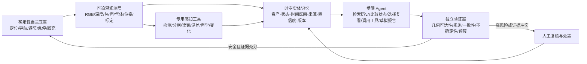

# 巡检机器人系统与 Agent 学术调研

> 调研截止：2026-09-01
>
> 适用项目：园区巡检机器人长期记忆系统
>
> 文档性质：学术调研与研究设计输入，不代表已冻结的技术选型

## 1. 调研范围、方法与证据口径

本文关注能够进入真实巡检系统链路的研究：移动平台与自主运行、可见光/热/声/气体/三维感知、跨次变化与异常检测、任务规划、具身问答、长期记忆、主动复核和报告生成。固定工位工业质检、通用具身智能和纯视觉语言模型只在其结论可迁移到巡检机器人时纳入。

检索优先使用论文原文、正式出版社页面、作者项目页和官方数据集页。下文把论文中的事实、本文的综合判断和面向本项目的建议分开表达：

- **文献事实**：论文明确给出的系统组成、数据、指标和实验条件。
- **综合判断**：由多篇工作对照得到的解释，不冒充论文结论。
- **项目建议**：针对当前园区 Demo 的设计建议，仍需通过实验验证。

检索按“inspection/patrol robot + power/substation/oil gas/nuclear/tunnel/bridge/wind/construction”“LLM/VLM/agent + inspection/anomaly/active perception”“long-term autonomy/spatio-temporal memory/change detection/lifelong SLAM”等主题簇展开，并从代表论文的引用链补充早期现场系统。本文选取 48 篇最能支撑系统比较的原始工作；它是面向方案设计的范围综述，不是带完整数据库检索式和 PRISMA 流程的系统综述。不同论文的数据、异常定义和指标不可直接排名，2025–2026 年预印本也可能继续修订。

为避免把离线模型分数误读为机器人能力，本文使用四级证据标记：

| 等级 | 含义 | 可以支持的结论 |
|---|---|---|
| E1 | 真实场地、重复或长期自主部署 | 系统可靠性、人工干预、任务吞吐和真实环境退化 |
| E2 | 真机闭环原型，但时间短、场景少或异常人为布置 | 链路可行性与主要失效模式 |
| E3 | 仿真、预采集观测池或真实数据集离线评测 | 算法相对能力，不能外推整机自主性 |
| E4 | 概念演示、定性案例或公开摘要缺少完整量化结果 | 研究方向线索，不能据此声称有效 |

需要特别说明：本文所称 **Agent** 不等同于“用了 LLM/VLM”。只有当系统能围绕目标维持状态，并在多个步骤中选择观测、检索、分析、导航或报告工具，根据反馈继续行动，才视为 Agent；单帧描述、一次性问答或把固定流程换成自然语言接口，只算 Agent 的组件或弱形态。

## 2. 执行摘要

### 2.1 最重要的六个结论

1. **真实长期巡检的强项仍是经典机器人系统工程，而不是大模型推理。** AutoInspect 这类代表系统依靠多传感定位、拓扑任务图、确定性任务执行器、进程守护和自动回充完成跨周部署。它证明了“能反复到点、稳定采样、失败后恢复”的价值，但语义理解、异常解释和历史推理仍较弱。

2. **Agent 相关工作已经形成三条路线。** 第一条用 LLM 把自然语言任务分解为机器人函数；第二条让多模态模型主动调用局部放大、正常样本检索、规则检索或多视角观测工具；第三条把时空记忆、场景图和历史证据作为规划与问答的外部状态。对巡检最有价值的是后两条，而不是自由生成底层运动指令。

3. **当前“Agent 化巡检”的最好数字大多来自离线或仿真。** 工业异常 Agent 在标准数据集上可以明显提高分类或定位，具身安全检查和桥梁问答也能通过多步观察改善结果；但它们通常没有经历定位漂移、网络中断、机器人自噪声、重复巡检和数周记忆污染。模型分数不能替代任务成功率、每公里误报、MTBI 和人工干预。

4. **单个通用 VLM 不足以承担巡检判定。** InspectVLM 在粗粒度异常标记上优于相应视觉基线，但细裂纹检测明显较弱，并出现回答塌缩和退化框；施工安全巡检中的错误图像描述也会被后续 RAG 和报告模块忠实放大。可靠系统需要可追溯证据、专用检测器、多视角复核和拒答机制。

5. **长期记忆不是“保存更多 caption”。** ReMEmbR 证明时空检索可以支持长视频后的导航问答，但长时段位置误差仍大，重复、低质量描述会稀释检索。Khronos、RIO/3RScan 等工作进一步说明，巡检记忆应以持久实体、位置、状态区间、观测来源和不确定性为骨架，同时保留原始帧/点云引用。

6. **目前没有一个公开基准同时覆盖园区跨次重访、多模态异常、实体级长期记忆、Agent 主动复核和无人值守系统指标。** 这不是调研遗漏，而是一个真实研究空缺。当前 10 天、40 次左右的园区采集若设计好时间切分、稳定负例、状态恢复和 Agent 复核预算，有机会形成比“再做一个异常分类器”更有辨识度的研究问题。

### 2.2 对当前项目的一句话建议

采用“**确定性自主底座 + 可回滚的时空实体记忆 + 受限工具调用 Agent + 独立校验/人工门控**”四层架构。近期不要让大模型直接接管行走、避障或安全动作；先验证它能否利用历史证据决定“是否需要复看、去哪里复看、调用什么专用工具、如何形成有引用的报告”。

## 3. 巡检任务的学术版图

巡检并不是一个单一任务。完整系统至少包含以下六层，现有论文通常只覆盖其中一到三层：

| 层次 | 典型问题 | 常见方法 | 常见指标 | Agent 的潜在作用 |
|---|---|---|---|---|
| 机动与覆盖 | 能否到达、重复走、避障、回充 | SLAM、teach-and-repeat、拓扑图、覆盖/路径规划 | 到达率、覆盖率、ATE、SPL、能耗、干预 | 解释任务、选择高层目标；不应替代安全控制器 |
| 稳定采样 | 能否以可比较视角获取图像、热、声、气体或辐射 | 位姿对准、云台、停驻采样、传感器标定 | 重复视角误差、有效动作率、信噪比 | 选择传感器、采样时长或补拍视角 |
| 状态与异常 | 是否新增、移除、移动、损坏、过热、异响或泄漏 | 变化检测、异常检测、专用识别器、多模态融合 | 事件级 P/R/F1、AUROC/AU-PRO、假警/公里 | 放大局部、调用检测器、检索正常参照、综合证据 |
| 时空记忆 | 过去在哪里、何时、以什么证据看到过什么 | 场景图、对象级地图、向量库、事件库、时序知识图谱 | 实体关联 F1、检索正确率、时间/位置误差、污染率 | 按问题检索、比较多次状态、发现证据缺口 |
| 任务与复核 | 先查哪里、何时偏离路线、何时停止或上报 | 任务图、行为树、POMDP、LLM/VLM Agent | 任务成功率、复核收益、工具成本、恢复率 | 分解目标、有限工具调用、预算化主动观测 |
| 报告与处置 | 如何给出可审计结论并与人协作 | 模板、RAG、规则库、具身问答、人机交互 | 事实正确率、证据引用率、严重度校准、人工耗时 | 汇总证据、引用规程、生成草案、请求人工确认 |

## 4. 从真实巡检系统看“整机能力”的上限

### 4.1 代表系统总表

| 工作 | 任务与平台 | 系统方案 | 公开效果 | 证据与边界 |
|---|---|---|---|---|
| [AutoInspect, 2024](https://arxiv.org/abs/2404.12785) | 核设施、化工、矿井等；Spot + LiDAR/鱼眼/IMU/可见光热像，可外挂温湿度和伽马 | VILENS 定位，先验点云配准，拓扑任务图，任务调度、自动回充、进程守护；LiSTA 跨任务三维变化 | B1 连续 49 天、84 次任务、13.6 km，673/730 个巡检动作成功（92.2%）；JET 连续 35 天、81 次任务、15 km。排除轻微干预后的 MTBI 分别为 78 h、140 h，最长 14/15 天无严重或致命干预 | **E1**。日历跨度长，但有效运行只有 13 h 和 19.5 h；初始地图、拓扑点和任务由人配置，变化检测离线，未报告异常检测 P/R |
| [Watching Grass Grow, 2024](https://arxiv.org/abs/2404.10446) | 林地长期生态采样；Husky + 双目/激光/单目/热/多光谱 | 视觉拓扑经验图、teach-and-repeat、拓扑超图旅行商规划、自动回充与卸数 | 六周、超过 14 km；最长单次连续自主 1 h 45 min；75 条教授边中，46 条（61%）在重采机会中无需重教 | **E1**。路线被维护，植被变化会导致重教；没有异常标签，但很好地展示“正常长期变化” |
| [ANYmal 输送机声学诊断, 2021](https://www.mdpi.com/2076-3417/11/5/2299) | 矿区约 100 m 输送机；ANYmal + 麦克风/相机/热像 | 移动采声，频带和自相关分析周期故障，再汇总故障分数 | 两处已知一类损伤均检出；故障处聚合分数约 60%–80%，普通干扰低于 30% | **E2**。样本极少，声学算法主要事后分析，无大样本假警率或跨日验证 |
| [云端热异常巡检, 2020](https://www.mdpi.com/1424-8220/20/21/6348) | 六轮移动机器人 + 热/可见光，可调度无人机复查 | 边缘阈值告警，云端热—可见光配准和报告，机器人—无人机协同 | 实验室布置 5 个热目标均检测；初始告警平均 6.7 s，完整响应/报告约 16.03 min | **E2**。未报告假警率，仅 5 个目标；通信和云端处理是主要链路成本 |
| [天然气泄漏四足巡检, 2024](https://doi.org/10.1051/ijmqe/2024017) | 100×50 m 真实区域；四足 + LiDAR + TDLAS 甲烷传感器 | 预建二维图，优化 RRT* 全局路径 + DWA 局部避障 | 人工气袋 400–1500 ppm·m，机器人在阀井附近测到约 800 ppm·m；真实路径 63.8 m 降至 57.6 m（−9.7%） | **E2**。主要贡献是路径规划；单场地/少量布置，未给检测率或源定位误差 |
| [埃特纳火山气体监测, 2026](https://arxiv.org/abs/2601.07362) | ANYmal + 6×D435i/VLP-16/IMU/GNSS/质谱仪 | LiDAR-SLAM，GNSS/惯性/运动学因子图，GPU 可通行图与规划，在线质谱 | 三次自主任务均检测人工气源，自主率 93%–100%；受控条件质谱检出限 <1 ppm、响应约 3 s | **E2/预印本**。天然火山气体任务仍为遥操作；无长期重访、假警或源定位精度 |

### 4.2 跨行业现场系统补充

下表覆盖电力、油气、核设施、地下空间、风机和桥梁。它们的共同价值，是把论文中“真实现场”进一步拆成运营资产、停用设施/竞赛场、遥控采集和长期重复部署。

| 工作 | 场景、任务与方案 | 量化结果 | 证据边界 |
|---|---|---|---|
| [变电站自主巡检机器人, 2013](https://www.scitepress.org/PublishedPapers/2013/44805/) | 日本约 400×400 m 运营变电站；Segway RMP 200/ATV，激光/里程计/云台相机/麦克风；在稠密 3D 模型中以粒子滤波定位，人工预设检查点 | 单次约 1 km、23 min、5 个检查点，5/5 照片被操作员接受；典型定位约 10 cm、10 Hz，短距离局部约 3 cm | **E2/F1**。无绕障，只能停车等待；无自动读表/目标确认，未给多轮成功率与长期可靠性 |
| [VIKINGS/ARGOS, 2019](https://doi.org/10.1109/MRA.2018.2877189) | 退役天然气脱水装置；67 kg 履带机器人，LiDAR/热像/可见光/声学/甲烷；粒子定位、图规划、任务脚本执行读表/阀位/热/声/气 | 三轮竞赛累计 25 km；实验室定位 RMSE 0.0261 m/0.334°。仪表在 25.8% 不确定样本之外 97.4% 正确，阀门在 19.4% 不确定样本之外 83.5% 正确 | **E2/F2**。竞赛设施、人工建图/检查点，可人工切模式；未正式完成 ATEX 认证，也未给逐任务完成率 |
| [CARMA 核设施辐射监测, 2019](https://doi.org/10.1109/MRA.2018.2879755) | 改装 TurtleBot 2 + α/β、γ、LiDAR/深度/近距传感；ROS SLAM、自主探索，生成几何—辐射联合地图，热点可触发绕行 | 在 Sellafield 活跃设施两次部署，成功检测和定位固定污染源；扫查约 0.1–0.2 m/s，20–30 s 驻留改善估计，地图分辨率约 5–10 cm | **E2/F1**。任务长度、接管和现场定位误差未报告；无辐射加固，只适用于人可进入的低剂量平整环境 |
| [CERBERUS, 2022](https://doi.org/10.55417/fr.2022011) | ANYmal/UAV/轮式多机器人在 DARPA 地下矿井与未投运核设施探索；多传感 SLAM、图搜索、通信与目标识别 | 60 min 竞赛任务；Tunnel Circuit 报告 6 个目标得 5 分，Urban 报告 11 个得 7 分；代表 UAV 自主 180 m 并返航，10 m RPE 0.11 m/0.86° | **E2/F2**。更接近地下搜索而非设备诊断；存在人工过门/航点/遥控，暴露失联不返航、卡障碍和恢复状态机失败 |
| [反应式隧道 UAV, 2024](https://doi.org/10.1016/j.autcon.2024.105424) | DJI Mavic 2 在停用铁路隧道 move–pause–photo 扫描；不建全局图，利用机载视觉/距离/红外做反应控制，SfM 后处理 | 在 1,200 m 隧道中实际验证 38 m；水平误差 <0.7 m、高度约 0.3 m，重建达到厘米级 | **E2/F2**。全程监督，未报告缺陷 P/R；气流、照明、横通道和长距离仍未验证 |
| [BladeView, 2025](https://doi.org/10.1109/TASE.2024.3464640) | DJI M600 + VLP-16/相机/IMU/GPS；自动估计塔架和叶片几何，在安全走廊内规划三片叶片多表面覆盖轨迹 | 7 类环境共 9,239 次现场飞行，各场景成功率 96%–99%，19–28 min/台；100 次稳定性测试成功率 96.8%、平均照片覆盖 95% | **E1/D**。成功把飞手接管算失败，但仍有安全飞行员；强在自动采集，尚未闭环到缺陷诊断和维修决策 |
| [桥梁损伤巡检与建图, 2025](https://doi.org/10.1016/j.autcon.2024.105951) | 遥控 Husky + VLP-16/RealSense；KISS-ICP 建图，YOLOv7 裂缝/剥落实例分割并登记到点云 | 70 m 实桥；迁移后裂缝/剥落 mAP@0.5 为 0.769/0.913，可分割约 1.5 mm 裂缝 | **E2/F1**。机器人运动为遥控，未给 SLAM 绝对误差、任务成功率或长期重访 |
| [CCRobot-M-II 悬索桥主缆巡检, 2026](https://doi.org/10.1007/s42235-025-00818-1) | 仿尺蠖夹爪机器人沿主缆扶手绳运动；风速/夹力/IMU/编码器和多相机，状态机控制与滑移保护 | 实桥有效巡检约 251 m，最高 7.16 m/min；实验室 12.43 m 累计误差率 2.4‰ | **E2/F1**。远端命令驱动、无全局 SLAM，AI 损伤识别尚未集成，雨雪停用 |

### 4.3 AutoInspect 为什么是当前最重要的系统参照

AutoInspect 的价值不在于单个算法分数，而在于把定位、任务执行、传感动作、回充、日志和故障恢复放进同一长期循环。它还暴露了三条容易被“连续部署 49 天”标题掩盖的事实：

1. 长期部署并不等于持续运动，B1/JET 的活跃运行只有十几到二十小时；因此本项目也应同时报告日历跨度、活跃时长、里程和完整 Run 数。
2. 673/730 的巡检动作成功率与 84 次任务是否完成是不同粒度；应分别统计导航任务、检查点动作和有效证据采集。
3. 初次建图、任务点和拓扑边由人创建并不削弱工程价值，但说明系统尚未解决“自己发现值得巡检的对象”和“根据异常主动改变计划”。这正是 Agent 能合理进入的上层空间。

### 4.4 从真实系统得到的工程约束

**综合判断：**成熟系统把高频、安全关键行为放在确定性模块里，把语义决策放在低频层。实际瓶颈经常不是大模型推理，而是重复定位失败、视角不一致、传感器/进程异常、误触发、通信、回充和恢复。若一个 Agent 论文没有报告这些变量，它只能证明语义模块，而不能证明巡检机器人系统。

## 5. 与巡检直接相关的 Agent 工作

### 5.1 工作分型

| Agent 形态 | 代表工作 | Agent 实际决定什么 | 主要贡献 | 当前证据短板 |
|---|---|---|---|---|
| 自然语言任务规划 | [InspectionGPT, 2024](https://ieeexplore.ieee.org/document/10606757/)、[RoboSpection, 2026](https://doi.org/10.1016/j.rcim.2025.103154) | 把人类指令映射为地图、视觉、点云、运动等函数序列 | 降低任务编程门槛，支持人机协作和解释 | 指令集较窄；生成正确不等于物理执行成功；长期自主证据弱 |
| 模块化安全巡检流水线 | [施工现场 VLM–LLM 巡检, 2025](https://arxiv.org/abs/2512.13974) | 调用视觉描述、法规检索、危险判定和报告模块 | 判定过程可拆解，可引用 OSHA 规则并生成报告 | 预设路线、实验室场景；上游 caption 错误会贯穿全链路 |
| 工具增强异常 Agent | [AgentIAD, 2025/2026](https://arxiv.org/abs/2512.13671)、[IndusAgent, 2026](https://arxiv.org/abs/2605.20682) | 在全图判断不充分时选择局部放大、正常样本/先验检索、高频增强，再复判 | 把“看一眼”改为可解释的多步检查轨迹 | 标准数据集离线评测；工具并不控制真实相机或机器人位姿 |
| 多视角/主动观察 Agent | [Large Models in Dialogue](https://arxiv.org/abs/2501.16300)、[ActiveInspect](https://doi.org/10.3390/s26154932)、[AVATAR](https://arxiv.org/abs/2605.25407) | 在预算内选择下一视角/模态，或控制移动以消除异常不确定性 | 最贴近巡检中的“发现—复核”闭环 | 分别受限于仿真、预采集观测池和受控机械臂路径；真机长期证据不足 |
| 记忆驱动 Agent | [ReMEmbR, 2025](https://arxiv.org/abs/2409.13682)、BridgeEQA、HomeSafeBench | 检索过去的文本/图像/位置/时间，决定下一步查询、移动或回答 | 让机器人利用超出上下文窗口的历史，并能引用空间证据 | 多为问答/仿真；位置误差、重复记忆和错误写入仍明显 |
| 多 Agent 角色分工 | [Multi-Agent Robotic Control, 2026](https://arxiv.org/abs/2607.07403) | 监督 Agent 维护计划，巡检/安全 Agent 分工，Nav2/MoveIt 执行 | 将安全规则检索与任务执行角色解耦，可本地运行 | 量化结果只覆盖箱体感知，hardware-in-the-loop 不等于实体仓库长期闭环 |

### 5.2 InspectionGPT：把巡检指令变成函数计划

InspectionGPT 使用轻量 LLM、机器人函数库、任务管理器和粗到细两阶段推理，将自然语言转成地图、语言、运动和视觉函数调用，并在真实场景做任务演示。公开摘要声称 14B 模型在语言理解和生成上优于传统系统，消融也支持两阶段推理；但公开可核实的一手摘要没有给出完整成功率、任务数量和干预数据，因此本文不补造数字，证据记为 **E4**。

它对本项目的启示不是“用更大的模型”，而是接口设计：Agent 只能从白名单技能中选择，任务管理器记录每一步前置条件、结果和失败原因，底层运动继续由现有控制栈执行。

### 5.3 RoboSpection：离线 LLM + ROS 的人机协作检查

[Human–robot collaborative visual inspection with Large Language Models](https://trepo.tuni.fi/bitstream/handle/10024/231195/Human_robot_collaborative.pdf?sequence=1&isAllowed=y) 使用 Franka、末端 RealSense D435、ROS/MoveIt 和本地代码 LLM。语音经 Whisper 转写，LLM 只调用点云获取、聚类、检查轮廓生成、目标生成和路径执行 API；低层碰撞规划仍由传统机器人软件完成。

论文对 230 条检查指令评测 8 个本地模型。Qwen2.5-Coder-1.5B-Instruct 的 F1 为 0.861、平均生成时间 1.29 s、显存 3.4 GB；StarCoder2-15B 的 F1 最高为 0.940，但平均 5.83 s。选定 1.5B 模型后，在 23 类指令的 230 个变体上，整体可行性 0.78、最低执行成功率 0.82、任务成功率 79.57%。四个对象完成五个主要闭环步骤（不计机械臂运动）的总时间为 73.78–94.72 s，其中代码推理合计仅 13.75 s。

这是很有价值的 **E2/E3** 证据：一方面说明小模型和受限 API 足以承担交互；另一方面暴露“cluster point cloud”“plan and execute path”等提示变体的成功率只有 20%，真实环境还出现误听和提前触发，拥挤场景发生少量碰撞，单视角点云遮挡会破坏轨迹生成。论文的真机部分仅是模拟吸水辊 proof-of-concept，没有报告长期重复成功率。

### 5.4 施工现场多层 VLM–LLM：可审计，但错误会级联

[Autonomous Construction-Site Safety Inspection Using Mobile Robots](https://arxiv.org/abs/2512.13974) 使用 Unitree Go2、LiDAR、RGB 和 RTAB-Map/Nav2 沿人工给定航点巡检。感知/推理按四层组织：Gemma-3 视觉描述，Llama-3.3 + OSHA RAG 生成安全/不安全规则，Gemma-3 做逐帧危险和严重度判断，DeepSeek-R1 汇总报告。

三个实验室场景、各三次运行，共 442 帧。相对 GPT-4o 基线，该框架在场景 A/B/C 的 F1 分别为 86.6/83.0/77.2%，基线为 81.9/80.0/74.4%；Recall 分别为 92.2/85.9/78.6%。这是 **E2** 的模块链路证据，不是无人值守部署证据。一个蓝色水容器被上游描述成油漆罐后，规则检索和报告都沿着错误前提工作，清楚说明“有 RAG”并不自动可靠。

### 5.5 工业异常 Agent：局部放大、正常参照和工具效率

[AgentIAD](https://arxiv.org/abs/2512.13671) 当前 v2 的正式标题为 *Agentic Industrial Anomaly Detection via Adaptive Memory Augmentation*。Qwen2.5-VL-3B 在统一循环中调用 Perceptive Zoomer（局部细看）、Comparative Retriever（正常样本对照）和 Web Searcher（语义知识），再通过工具感知 SFT 与 GRPO 学习何时取证。MMAD one-shot 平均分为 82.88，对比 AnomalyR1 的 76.96、GPT-4o 的 74.92 和原始 Qwen2.5-VL-3B 的 62.94；缺陷定位为 80.94，对比 AnomalyR1 的 70.14；四个二分类异常数据集平均准确率为 97.46%。论文输出逐步检查轨迹。

2026 年的 [IndusAgent](https://arxiv.org/abs/2605.20682) 进一步加入动态裁剪、高频特征增强和正常先验检索，用门控奖励约束“只有有益时才调用”。

这些工作证明“工具增强多步检查”可能优于一次性 VLM，但仍属 **E3/预印本**：输入是数据集图像，所谓主动观察通常是裁剪已有像素，而非机器人真正改变位姿；正常参照库也没有经历长期错误写入和域漂移。本项目若借鉴，应把工具从 `crop(image)` 升级为 `reobserve(asset_id, viewpoint, modality, duration)`，并同时计量导航时间、能耗和新增证据质量。

### 5.6 主动观察与预算化证据选择：目前最接近“复看”的三类证据

| 工作 | Agent 如何主动 | 绝对结果 | 证据边界 |
|---|---|---|---|
| [Large Models in Dialogue for Active Perception and Anomaly Detection](https://arxiv.org/abs/2501.16300) | LLM 向 VQA 模型提问，并从预定义自然语言飞行动作中选择下一动作；疑似异常触发提前终止常规探索、进入验证 | AirSim 四类场景各 10 次：异常准确率山地 0.53→0.90、广场 0.43→0.73、湖泊 0.26→0.76、雪地 0.20→0.83；异常触发后平均探索时间从约 11:48–13:26 缩至 5 min 内 | **E3/仿真**。动作有限、循环慢、有幻觉；没有长期记忆、风险验证或真机成本 |
| [ActiveInspect](https://doi.org/10.3390/s26154932) | 在多视角/多模态观测池中依次请求证据、裁剪、比较正常参照并决定停止，以 GRPO 平衡置信度与预算 | Real-IAD D3 I-AUROC 0.906、平均 2.7 次观测；单 RGB 0.846/1.0，随机三观测 0.872/3，启发式三观测 0.884/3，穷举 15 观测 oracle 0.908/15；推理 3.2 s/样本，穷举 16.8 s | **E3/预采集观测池**。没有实体相机移动、传感切换、路径、能耗和风险，不能称真机主动巡检 |
| [AVATAR](https://arxiv.org/abs/2605.25407) | UR 机械臂按等面积候选视角采集 RealSense 图像和精确位姿 CAD twin，比较 DINOv2 特征残差；观察路径预先给定 | 216 个正常 real–render 训练对、214 个未见 J6 关节测试对；图像 AUROC/AP/F1 为 71.15/90.24/89.84，像素 AUROC/AP/F1/AUPRO 为 90.55/23.75/33.07/46.57；像素 AP/F1 比 UniAD 高 8.62/10.50 个百分点 | **E2/E3**。真机采集但受控制造环境、小数据、固定主动路径；不是根据不确定性在线选视角 |

三类证据合起来说明：主动检查的收益来自**补充互补证据并适时停止**，但现有论文分别省略了真实运动成本、在线决策或长期环境漂移。园区实验必须把“模型观测次数”换算为真实额外距离、时间、能耗、失败概率和主任务延误。

### 5.7 多 Agent 分工与规则—模型边界

[Multi-Agent Robotic Control with Onboard Vision-Language Models](https://arxiv.org/abs/2607.07403) 在 O3DE hardware-in-the-loop 仓库中设置监督、巡检和安全 Agent，Nav2/MoveIt 继续负责确定性控制。微调 LFM2-VL-3B 后，箱体状态分类准确率由 76.7% 提到 91.5%，F1 由 0.755 提到 0.915，假正率由 46% 降到 4.5%。但论文没有给五项任务的整机成功率、端到端时延和安全召回，抓取姿态还使用仿真真值，因此“91.5%”只属于感知组件。

2026 年的[多机器人故障诊断研究](https://doi.org/10.1007/s10015-026-01136-3)给出更重要的角色边界：在复杂、多跳解释问题上，Qwen + 专家知识的 HumanEval 为 0.900，规则图谱为 0.450；但在遥测阈值题上，规则图谱 precision/recall/HumanEval 达 0.970/0.956/1.000，Qwen 只有 0.354/0.401/0.682。也就是说，LLM 适合整合异构证据和解释，温度、电量、碰撞、定位置信度等硬阈值应由确定性规则触发。

### 5.8 领域 VLM 并不等于 Agent

[Power-LLaVA](https://arxiv.org/abs/2407.19178) 以 20,000 张输电线路图像、608,000 条图文对齐数据和 100,000 条指令数据训练领域助手，在 1,000 题 PowerQA 上达到 86.79%，略高于论文中的 GPT-4V 85.11%。但该基准是由 GPT-4V 生成并经人工核验的多选问答，系统不控制机器人，也不进行跨次检查，所以只能作为领域知识/报告组件的 **E3** 证据。

[InspectVLM](https://openaccess.thecvf.com/content/ICCV2025W/VISION%2725/html/Wallace_InspectVLM_Unified_in_Theory_Unreliable_in_Practice_ICCVW_2025_paper.html) 在含 292,341 张无人机图像、694,905 个区域标注的 InspectMM 上做异常标记、风机裂纹和资产计数。它在异常标记上的准确率/召回率为 75.9/89.5%，优于 ResNet-50 的 66.7/59.3%；但细裂纹 precision/recall 只有 16.5/19.8%，显著弱于 Faster R-CNN 的 46.1/43.7，训练后还出现 VQA 回答 100% 为“yes”和退化大框。该工作是本调研最重要的负面证据之一：统一接口很诱人，但粗语义、细粒度定位和计数需要不同归纳偏置与验证器。

## 6. 可迁移的具身 Agent、记忆与主动感知工作

### 6.1 ReMEmbR：长时空记忆如何支持机器人问答与导航

[ReMEmbR](https://arxiv.org/abs/2409.13682) 每 3 s 用 VLM 为视频生成描述，把文本嵌入、机器人位置和时间写入向量库；查询时 LLM 可进行最多三轮文本、位置和时间检索，再返回地点或时间。NaVQA 含 7 段 CODa 序列上的 210 个问题，原始序列 15–30 min。

GPT-4o 作为推理器时，短/中/长视频的总体正确率为 0.72/0.56/0.61；位置误差为 5.1/27.5/46.25 m，时间误差为 0.3/1.8/3.6 s。只允许一次检索时正确率降到 0.67/0.48/0.50；把描述间隔从 3 s 放宽到 12 s 时降到 0.54/0.50/0.38。真机 Nova Carter 在构建 25 min 记忆后完成了去零食架、餐饮区和大厅等定性导航，但曾因 3B VLM 将饮料机描述错误而混淆目标。

这说明多轮检索和密集记忆确有作用，也说明纯文本记忆会把感知错误固化。适合巡检的改造应把描述绑定到资产 ID、6-DoF 位姿、原始帧、传感器标定和置信度，并允许回看证据而非只相信 caption。

### 6.2 Khronos：把“地图”升级为有历史的实体状态

[Khronos](https://arxiv.org/abs/2402.13817) 在活动时间窗口中实时融合动态场景，把物体形成片段，再由后台因子图、地图形变和片段关联恢复物体出现、移动和消失历史。系统在 Jackal 和 Spot 上运行，活动窗口前端为 45.5±9.2 ms/帧（约 22.2 FPS）；片段重建和背景形变通常低于 1 s，全局回环优化异步执行。

相较向量库，Khronos 更接近本项目需要的“实体—状态—时间区间”骨架，但实验中的椅子、冷藏箱等变化规模较小且经过编排，关联依赖上游语义和几何质量。它应作为记忆表示参照，而非现成完整答案。

### 6.3 SayPlan、SayNav 与 KARMA：让 LLM 在结构化世界上规划

- [SayPlan](https://proceedings.mlr.press/v229/rana23a/rana23a.pdf) 在预建的分层 3D 场景图上做展开/折叠式语义搜索，LLM 生成高层计划，经典规划器求路径，并用场景图模拟器反馈错误后重规划。其优势是能处理多楼层大场景，边界是需要较完整的预建图，真实演示主要为定性。
- [SayNav](https://arxiv.org/abs/2309.04077) 边探索边构建 3D 场景图，LLM 只规划短步目标，低层由 PointNav 执行。在 ProcTHOR MultiON 中，视觉里程计 + PointNav 版本的成功率为 61.60%、SPL 0.35；真实咖啡厅只做了定性展示。
- [KARMA](https://arxiv.org/abs/2409.14908) 把长期静态场景图与短期易变视觉记忆分开，并由 GPT-4o 调用固定 API。ALFRED-L 中，简单/组合/复杂任务成功率由无记忆基线的 0.41/0.23/0.04 变为 0.42/0.43/0.21；但实验完全在理想仿真中，系统开环、没有真实反馈纠错。

三者共同支持一个设计原则：LLM 应在紧凑、结构化、可检索的世界模型上做低频高层规划，低层控制与可达性验证由专用模块负责。

### 6.4 OpenEQA、BridgeEQA 与 HomeSafeBench：从“回答问题”到“主动查证”

- [OpenEQA](https://openaccess.thecvf.com/content/CVPR2024/papers/Majumdar_OpenEQA_Embodied_Question_Answering_in_the_Era_of_Foundation_Models_CVPR_2024_paper.pdf) 含 1,600 余个非模板问题和 180 余段视频/扫描。GPT-4V 得分 48.5，而人类为 85.9，表明强 VLM 距离可靠环境记忆仍远。
- [BridgeEQA](https://arxiv.org/abs/2511.12676) 基于 200 座桥、9,586 张图像和 2,200 个问答，把检查影像组织成可遍历图，Agent 可移动、分析单图/多图并引用证据。相对一次性多帧基线，桥梁等级 ±1 准确率提高 9.34 个百分点，图像引用相关性提高 20.2 个百分点，回答正确性提高 7.2 个百分点。它仍使用预采集图像图，不是现场主动飞行。
- [HomeSafeBench](https://arxiv.org/abs/2509.23690) 在 VirtualHome 中评测自由探索式家庭安全检查，包含 1,000 个经人工确认的任务。最佳闭源 VLM 的 F1 约 34.7，而人类为 98.0；带回溯监督的 CueBack 将 4B 模型 OOD 平均 F1 从 18.7 提到 45.3。它证明“漏看”是主动检查的核心问题，但目前只是仿真。

这些工作适合定义本项目的 Agent 能力：不仅回答“有无异常”，还要给出 `run_id + asset_id + timestamp + pose + evidence_uri`，并在证据不足时明确请求复看，而不是填补答案。

### 6.5 执行反馈、不确定性校准与安全降级

- [Inner Monologue](https://arxiv.org/abs/2207.05608) 在每次动作后把对象列表、执行成功、场景进展或人类回答反馈给 LLM，使其重规划和重试。在 Everyday Robots 厨房的 120 次评测中，SayCan 成功率 30.8%，加入成功反馈为 48.7%，对象 + 成功反馈为 60.4%；扰动移动操作中分别为 0%/25%/75%。但部分反馈来自脚本或人工 oracle，不能直接外推无人值守系统。
- [KnowNo](https://arxiv.org/abs/2307.01928) 用 conformal prediction 校准 LLM 候选动作集合：唯一时执行，有歧义时向人求助。真实硬件多步任务中计划/任务成功率为 0.76/0.74，不求助基线任务成功率仅 0.38；厨房任务 KnowNo 为 0.76，NoHelp 为 0.51。其保证依赖校准分布稳定、低层技能可靠和约 400 个校准样本，但仍是比“让模型自报置信度”更强的降级证据。
- [SafePlan](https://arxiv.org/abs/2503.06892) 通过义务逻辑、前后条件和类 LTL 约束提示检查计划，修正失败则阻止执行。621 条合成任务上 Gemini-1.5-Pro + SafePlan 准确率 0.884、危险请求拒绝率 92.9%，但安全请求接受率只有 70.9%；所谓 formal logic 主要由提示实现，并不是经过认证的模型检查器。

**综合判断：**巡检 Agent 需要三种不同的“闭环”：物理执行后的观测反馈、统计校准后的求助/拒答、以及独立于 LLM 的确定性安全控制。三者不能被一段自我反思文本代替。

## 7. 跨次变化、异常和长期定位基准

### 7.1 与园区任务最相关的数据集

| 数据集/系统 | 真实/仿真与任务 | 规模和关键结果 | 对园区 Demo 的价值与不足 |
|---|---|---|---|
| [ChangeSim](https://arxiv.org/abs/2103.05368) | AirSim 仓库；新增、消失、替换、旋转，兼有定位/语义/三维 | 10 个仓库、80 条序列、1,146 个变化物体；代表序列正常 ATE 0.46–1.52 m，恶劣条件最高 4.43 m | 可借用变化类型和配准扰动协议；传感和变化均为仿真 |
| [OpenLORIS-Scene](https://arxiv.org/abs/1911.05603) | 真实服务机器人；长期定位/重定位 | 5 类场景、22 条序列、2,244 s；家庭场景跨次重定位对多数系统非常困难 | 可借用持续定位覆盖率、重定位成功率/延迟；时间跨度短，无异常标签 |
| [MCD](https://arxiv.org/abs/2403.11496) | 三个真实校园；昼夜定位、SLAM、语义分割 | 18 序列，>20 万激光帧、150 万相机帧；各方法至少一半序列 ATE >0.5 m，跨校园语义 mIoU 可下降 >70% | 最接近园区域偏移；不足是跨次状态与异常未标注 |
| [RIO/3RScan](https://openaccess.thecvf.com/content_ICCV_2019/html/Wald_RIO_3D_Object_Instance_Re-Localization_in_Changing_Indoor_Environments_ICCV_2019_paper.html) | 真实手持 RGB-D 重扫；物体实例重定位 | 478 个环境、1,482 次扫描，每处 2–12 个时间快照；实例重定位准确率 30.58% | 持久 ID、moved/removed/replaced 标注范式很有价值；非机器人连续路线 |
| [Boreas](https://arxiv.org/abs/2203.10168) | 真实车辆一年多季节重访；定位/检测 | 同路线 >350 km，LiDAR/成像雷达/5MP 相机/厘米级参考轨迹 | 可做季节/天气定位压力测试；速度视点不同，无实体异常 |
| [Real-IAD](https://arxiv.org/abs/2403.12580) | 固定五视角工业异常，含污染训练设置 | 30 类、151,050 图；7 方法平均图像 AUROC 从 MVTec AD 的 97.9% 降到单视角 87.6%、多视角 85.0% | 可借用多视角聚合和“正常库污染”实验；无机器人运动和时间跨度 |
| [MVTec LOCO AD](https://link.springer.com/article/10.1007/s11263-022-01578-9) | 固定相机；局部结构 + 全局逻辑异常 | 5 类、3,644 张图；GCAD 平均 AU-sPRO 0.701（像素 FPR≤5%） | 可迁移为灭火器缺失、数量/位置/开合错误；视角受控 |
| [MVTec 3D-AD](https://arxiv.org/abs/2112.09045) | 固定结构光 RGB+几何异常 | 10 类、4,147 扫描、41 种缺陷；体素 f-AnoGAN AU-PRO 0.583，加 RGB 为 0.639 | 可测几何损伤；不能代表跨次配准与移动平台噪声 |
| [MIMII](https://arxiv.org/abs/1909.09347) | 固定阵列声学故障 | 26,092 正常、6,065 异常 10 s 片段；−6 dB 时各机器 AUC 约 0.53–0.70 | 可做声学预训练/SNR 分层；缺机器人行走、自噪和距离变化 |
| [IMAD-DS](https://dcase.community/documents/workshop2024/proceedings/DCASE2024Workshop_Albertini_45.pdf) | 声/振/转速多传感，显式域偏移 | 机械臂源/目标域 AUC 93.28/90.48%；电机 73.63/55.59% | 直接展示环境变化会压过真实异常；但只是两台缩比设备 |

### 7.2 这些基准共同揭示的评价陷阱

1. **配准误差会伪装成变化。** 应同时在完美位姿、估计位姿和人为扰动位姿下评测，区分记忆/识别失败与定位失败。
2. **旧工业基准可能过度饱和。** 固定视角上的高 AUROC 不等于移动机器人上的高事件召回；Real-IAD 和 MCD 都显示域偏移造成大幅下降。
3. **正常库会被长期污染。** 若系统把未确认异常直接写成“新正常”，后续检测会系统性失效；需要写入门控、版本、来源和回滚。
4. **单帧指标不反映巡检成本。** 园区更关心每公里/每小时假警、首次可见到告警的时延、复看代价和人工复核时间。
5. **稳定负例与自然变化同样重要。** 光照、人群、班车、清扫、植被和施工是环境常态，不应全部视为异常。

## 8. 面向可靠巡检 Agent 的推荐系统结构

### 8.1 各层职责边界

- **确定性自主底座**：拥有运动控制权和急停权；Agent 只能提交目标点、检查技能和预算，不能直接下发关节/速度指令。
- **观测与专用工具**：保留原始证据和标定，不让所有模态先被压成文字；每个工具返回结果、置信度、适用边界和失败码。
- **时空实体记忆**：对象状态采用追加/版本化记录，不覆盖历史。将观测事实、模型推断、人工确认和规则知识分开存储。
- **Agent**：负责低频语义编排，例如“先检索消防箱上三次状态；若当前开合不确定，移动到侧前方补拍；再调用开合检测器；仍冲突则上报”。
- **验证器与人**：检查路径可达、复看预算、规则合规、证据是否支持结论。高风险异常只允许报告或请求人处理，不允许机器人擅自操作设施。

### 8.2 Agent 的最小工具集

建议先实现小而可评测的白名单，而非开放式代码执行：

| 工具 | 输入 | 输出 | 主要风险控制 |
|---|---|---|---|
| `query_history` | 资产/区域、时间窗、状态类型 | 带来源的历史观测列表 | 返回原始证据 URI 与版本，不只给摘要 |
| `compare_observations` | 当前与历史观测 ID | 属性变化、几何一致性、置信度 | 显式报告配准质量与不可比原因 |
| `run_detector` | 证据 ID、检测器名 | 位置/类别/分数/适用域 | 模型版本固定，禁止 Agent 自报检测分数 |
| `request_reobservation` | 资产、候选视角/模态/时长 | 受预算约束的高层任务请求 | 先过可达性与安全验证，底层自主栈执行 |
| `check_rule` | 候选事件、区域/设备类型 | 相关规则、适用条件、来源 | RAG 结果不直接变成事实，必须绑定现场证据 |
| `draft_incident` | 经确认的证据与规则引用 | 结构化报告草案 | 无证据字段不得填充；允许“不确定/需人工确认” |

## 9. 当前园区 Demo 可以形成的研究问题

当前方案为宇树 G1 在固定园区范围沿预设路线巡检，目标规模约 10 个有效日、40 次完整 Run，重点验证 L1 工作记忆、L2 跨 Run 情景记忆和 L3 巩固/图式化。下列是由调研推导出的**项目假设**，不是现有文献结论：

### H1：实体化时空记忆优于“最近一次图像”比较

在相同视觉检测器下，带持久资产 ID、状态区间、位姿/标定质量和多次历史的系统，能在位置、数量、朝向、开合、倒伏、出现/消失任务上提高事件级 F1，并降低稳定负例误报。

**最小对照：**无记忆；只比较最近一次；检索全部历史；带置信度、冲突和可回滚写入的历史。

### H2：预算化主动复看提高可靠性，而不是只增加计算

当首轮判断低置信或历史证据冲突时，Agent 从有限候选视角/模态中选择一次复看，相对固定单视角能降低假警和漏警；收益应按每分钟、每米和每焦耳的额外成本归一化。

**最小对照：**不复看；固定第二视角；随机视角；Agent 选择视角。必须同时报告触发率、复看后翻转率、正确翻转率和无效复看率。

### H3：证据约束报告优于直接 VLM 报告

要求每条结论引用 Run、时间、资产、位姿和原始证据，并由专用检测器/规则验证后再生成报告，可降低幻觉和严重度误判，并缩短人工核验时间。

**最小对照：**单帧 VLM；多帧直接输入；检索增强但无工具验证；带工具、引用与拒答的 Agent。

### H4：写入门控能延缓“异常被学成正常”

只有经多次一致观测或人工确认的状态才能进入长期常态；未确认变化保留为候选事件。相较无门控更新，该机制应降低错误记忆写入率和异常吸收率，同时保留对真实常态漂移的适应。

**最小对照：**每次覆盖；滑动平均；置信度门控；带人工确认和回滚的版本化更新。

## 10. 建议的统一评测协议

### 10.1 数据划分与实验单位

- 以一次完整巡检为一个 `Run/episode`，以固定资产、区域和路段为持久实体。
- 严格按时间向未来划分训练/验证/测试；同一人工异常的相邻帧、处置和恢复不得跨集合泄漏。
- 正常、人工变化、人工异常、自然扰动和真实事件分层报告；人工异常不得制造真实险情。
- 所有关键结果至少按独立 Run 汇总，并给出置信区间或逐 Run 分布，不能把相邻视频帧当成独立样本放大样本量。

### 10.2 分层指标

| 层次 | 必报指标 | 为什么需要 |
|---|---|---|
| 定位/导航 | 完整 Run 成功率、检查点覆盖率、持续定位覆盖率、重定位成功率/延迟、ATE/RPE、恢复距离 | 解释漏检是否源于没到、没看准或定位漂移 |
| 采样 | 有效巡检动作率、重复视角误差、各模态可用率、时间同步/标定合格率 | 保证跨次比较确实可比 |
| 异常/变化 | 事件级 precision/recall/F1、每公里与每小时假警、首次可见至告警时延、严重度校准 | 单帧 AUROC 无法反映现场告警负担 |
| 记忆 | 跨 Run 实体关联 F1、历史查询正确率、状态转移 F1、时间/位置误差、错误写入率、异常吸收率、回滚成功率 | 证明收益来自记忆而非更强单帧模型 |
| Agent | 工具选择正确率、计划可执行率、复看触发率、正确翻转/无效复看率、证据引用准确率、拒答校准、平均工具/时间/能耗成本 | 衡量 Agent 的决策价值与代价 |
| 系统 | 任务/动作成功率、活跃时长、里程、人工干预/公里、MTBI、最长无严重干预时间、回充率、端到端时延 | 与 AutoInspect 等真实系统对齐 |
| 安全 | 越权动作数、验证器拦截率、急停/保护停机、危险接近、人车混行中止、未授权设施操作数 | Agent 分数不能交换物理安全 |

### 10.3 必做消融与压力测试

1. 完美位姿、估计位姿、受控位姿扰动，拆分配准与识别错误。
2. 无历史、最近一次、完整历史、带门控/回滚历史。
3. 单次 VLM、固定工具链、可选择工具 Agent。
4. 无复看、固定复看、随机复看、Agent 复看。
5. 正常库 0%、小比例和逐步增长的错误写入污染。
6. 昼夜、逆光、雨后、行人/车辆、遮挡、路线变化和传感器缺失。
7. 本地断网、模型超时、工具失败、记忆检索空结果和相互矛盾证据。
8. 固定随机种子和模型/提示/工具版本；把提示变化作为实验变量，不把一次成功演示当结论。

## 11. 推荐实施顺序

### 阶段 0：先把非 Agent 基线做实

冻结路线、检查点、资产 ID、坐标系、标定、时间同步和安全边界；完成无记忆/最近一次比较基线。系统先能稳定记录“到没到、看没看、证据是否有效”。

### 阶段 1：离线 L1–L2 记忆闭环

完成观测追加、跨帧/跨 Run 实体关联、状态比较、证据检索和冲突/回滚。在历史数据上评测 H1/H4，不让 Agent 影响真机任务。

### 阶段 2：影子模式 Agent

Agent 读取真实巡检证据并提出工具调用、复看与报告建议，但不控制机器人；与固定规则和人工决策对照，先测计划可执行率、证据引用、误报和预算。

### 阶段 3：受限主动复看

只开放少量预验证技能，例如在安全检查点内转头、侧移到候选位姿、停驻录音或热成像；全部请求经过几何/安全验证器，失败自动返回固定路线。验证 H2/H3。

### 阶段 4：L3 巩固和长期稳定性

从多日状态推断区域功能、周期事件和处置图式，但采用候选—验证—发布—回滚流程；专门评测偶然现象过度概括和异常吸收。达到稳定证据后再考虑更开放的规划或 L4/L5。

## 12. 研究空缺与可发表性判断

### 12.1 已相对成熟、区分度较低的方向

- 只做固定路线导航或单次到点拍照；
- 在 MVTec 类固定视角数据集上替换一个异常检测模型；
- 用通用 VLM 为巡检图像生成自然语言描述；
- 只展示 LLM 能把若干指令映射到 ROS 函数；
- 没有时间切分、稳定负例和系统指标的“长期记忆”演示。

### 12.2 仍有明显空缺的方向

1. **真实跨次实体记忆与异常检测的耦合评测**：不仅识别变化，还要追踪变化前、发现、复核、处置和恢复的完整状态链。
2. **主动复看的净价值**：统一测量异常性能增益、额外时间/距离/能耗和对主路线的影响。
3. **记忆污染与可逆更新**：研究异常、误识别和自然域漂移如何进入长期常态，以及门控、冲突和回滚的效果。
4. **证据可审计的巡检 Agent**：报告中的每个事实都能回到原始传感证据，规划和工具调用可复现，不能只给自然语言解释。
5. **语义能力与整机可靠性的联合指标**：同时报告 F1/问答正确率与 MTBI、干预/公里、动作成功率，而不是各自孤立优化。

**综合判断：**最有辨识度的研究主线不是“做一个大模型巡检机器人”，而是“在真实多次巡检中，受限 Agent 如何利用可回滚的多模态时空记忆，以可量化成本主动补证，并在不削弱底层安全可靠性的前提下改善事件级判断和可审计报告”。

## 13. 主要参考文献

### 真实系统、主动巡检与多模态诊断

1. Staniaszek et al. [AutoInspect: Towards Long-Term Autonomous Industrial Inspection](https://arxiv.org/abs/2404.12785), 2024.
2. Gadd et al. [Watching Grass Grow: Long-Term Visual Navigation and Mission Planning for Autonomous Biodiversity Monitoring](https://arxiv.org/abs/2404.10446), 2024.
3. Stefaniak et al. [Belt Conveyors Rollers Diagnostics Based on Acoustic Signal Collected Using Autonomous Legged Inspection Robot](https://www.mdpi.com/2076-3417/11/5/2299), 2021.
4. Palacin et al. [Cloud-Based Monitoring of Thermal Anomalies in Industrial Environments Using AI and the Internet of Robotic Things](https://www.mdpi.com/1424-8220/20/21/6348), 2020.
5. [Path Planning of Quadruped Robot for Urban Natural Gas Pipe Leakage Inspection](https://doi.org/10.1051/ijmqe/2024017), 2024.
6. [Large-Scale Autonomous Gas Monitoring for Volcanic Environments: A Legged Robot on Mount Etna](https://arxiv.org/abs/2601.07362), 2026.
7. Liu et al. [Towards Active Real-to-Twin Inspection: A New Paradigm for Zero-Shot Anomaly Detection](https://arxiv.org/abs/2605.25407), 2026.

### 巡检 Agent、领域模型与具身问答

8. [InspectionGPT: A Large Language Model-Based System for Inspection Task Planning](https://ieeexplore.ieee.org/document/10606757/), 2024.
9. Tasneem and Pieters. [Human–robot collaborative visual inspection with Large Language Models](https://doi.org/10.1016/j.rcim.2025.103154), 2026; [code](https://github.com/CuriousLad1000/RoboSpection).
10. Naderi et al. [Autonomous Construction-Site Safety Inspection Using Mobile Robots: A Multilayer VLM-LLM Pipeline](https://arxiv.org/abs/2512.13974), 2025.
11. Miao et al. [AgentIAD: Agentic Industrial Anomaly Detection via Adaptive Memory Augmentation](https://arxiv.org/abs/2512.13671), v1 2025, v2 2026.
12. Tan et al. [IndusAgent: Reinforcing Open-Vocabulary Industrial Anomaly Detection with Agentic Tools](https://arxiv.org/abs/2605.20682), 2026.
13. Wallace et al. [InspectVLM: Unified in Theory, Unreliable in Practice](https://openaccess.thecvf.com/content/ICCV2025W/VISION%2725/html/Wallace_InspectVLM_Unified_in_Theory_Unreliable_in_Practice_ICCVW_2025_paper.html), 2025.
14. Wang et al. [Power-LLaVA: Large Language and Vision Assistant for Power Transmission Line Inspection](https://arxiv.org/abs/2407.19178), 2024.
15. Gu et al. [AnomalyGPT: Detecting Industrial Anomalies Using Large Vision-Language Models](https://arxiv.org/abs/2308.15366), AAAI 2024.
16. Varghese et al. [BridgeEQA: Virtual Embodied Agents for Real Bridge Inspections](https://arxiv.org/abs/2511.12676), 2026 version.
17. [HomeSafeBench: A Benchmark for Embodied Vision-Language Models in Free-Exploration Home Safety Inspection](https://arxiv.org/abs/2509.23690), 2025.
18. Majumdar et al. [OpenEQA: Embodied Question Answering in the Era of Foundation Models](https://openaccess.thecvf.com/content/CVPR2024/papers/Majumdar_OpenEQA_Embodied_Question_Answering_in_the_Era_of_Foundation_Models_CVPR_2024_paper.pdf), CVPR 2024.

### 长期记忆、场景图与具身规划

19. Anwar et al. [ReMEmbR: Building and Reasoning Over Long-Horizon Spatio-Temporal Memory for Robot Navigation](https://arxiv.org/abs/2409.13682), ICRA 2025.
20. Schmid et al. [Khronos: A Unified Approach for Spatio-Temporal Metric-Semantic SLAM in Dynamic Environments](https://www.roboticsproceedings.org/rss20/p081.pdf), RSS 2024.
21. Rana et al. [SayPlan: Grounding Large Language Models using 3D Scene Graphs for Scalable Robot Task Planning](https://proceedings.mlr.press/v229/rana23a/rana23a.pdf), CoRL 2023.
22. [SayNav: Grounding Large Language Models for Dynamic Planning to Navigation in New Environments](https://arxiv.org/abs/2309.04077), 2023.
23. [KARMA: Augmenting Embodied AI Agents with Long-and-short Term Memory](https://arxiv.org/abs/2409.14908), 2024.

### 跨次变化、定位与异常基准

24. Park et al. [ChangeSim: Towards End-to-End Online Scene Change Detection in Industrial Indoor Environments](https://arxiv.org/abs/2103.05368), 2021.
25. Shi et al. [Are We Ready for Service Robots? The OpenLORIS-Scene Datasets for Lifelong SLAM](https://arxiv.org/abs/1911.05603), 2020.
26. Zhang et al. [MCD: Diverse Large-Scale Multi-Campus Dataset for Robot Perception](https://arxiv.org/abs/2403.11496), 2024.
27. Wald et al. [RIO: 3D Object Instance Re-Localization in Changing Indoor Environments](https://openaccess.thecvf.com/content_ICCV_2019/html/Wald_RIO_3D_Object_Instance_Re-Localization_in_Changing_Indoor_Environments_ICCV_2019_paper.html), ICCV 2019.
28. Burnett et al. [Boreas: A Multi-Season Autonomous Driving Dataset](https://arxiv.org/abs/2203.10168), IJRR 2023.
29. Zou et al. [Real-IAD: A Real-World Multi-View Dataset for Benchmarking Versatile Industrial Anomaly Detection](https://arxiv.org/abs/2403.12580), CVPR 2024.
30. Bergmann et al. [Beyond Dents and Scratches: Logical Constraints in Unsupervised Anomaly Detection and Localization](https://link.springer.com/article/10.1007/s11263-022-01578-9), IJCV 2022.
31. Bergmann et al. [The MVTec 3D-AD Dataset for Unsupervised 3D Anomaly Detection and Localization](https://arxiv.org/abs/2112.09045), 2022.
32. Purohit et al. [MIMII Dataset: Sound Dataset for Malfunctioning Industrial Machine Investigation and Inspection](https://arxiv.org/abs/1909.09347), 2019.
33. Albertini et al. [IMAD-DS: A Dataset for Industrial Multi-Sensor Anomaly Detection Under Domain Shift Conditions](https://dcase.community/documents/workshop2024/proceedings/DCASE2024Workshop_Albertini_45.pdf), DCASE 2024.

### 补充实地系统与 Agent 机制证据

34. Chamiti et al. [Large Models in Dialogue for Active Perception and Anomaly Detection](https://arxiv.org/abs/2501.16300), ICPR 2024/arXiv 2025.
35. [ActiveInspect: GRPO-Optimized Multi-Sensor Evidence Selection for Industrial Defect Detection](https://doi.org/10.3390/s26154932), Sensors 2026.
36. [Multi-Agent Robotic Control with Onboard Vision-Language Models](https://arxiv.org/abs/2607.07403), 2026.
37. [Enhancing LLM Inference with Human Expert Knowledge: A Case Study on Multi-Agent Robotics Fault Diagnosis and Prediction](https://doi.org/10.1007/s10015-026-01136-3), 2026.
38. Huang et al. [Inner Monologue: Embodied Reasoning through Planning with Language Models](https://arxiv.org/abs/2207.05608), 2022.
39. Ren et al. [Robots That Ask for Help: Uncertainty Alignment for Large Language Model Planners](https://arxiv.org/abs/2307.01928), 2023.
40. [SafePlan: Leveraging Formal Logic and Chain-of-Thought Reasoning for Enhanced Safety in LLM-based Robotic Task Planning](https://arxiv.org/abs/2503.06892), 2025.
41. [An Autonomous Mobile Inspection Robot for an Electric Power Sub-station](https://doi.org/10.5220/0004480503000306), 2013.
42. [The VIKINGS Autonomous Inspection Robot: Competing in the ARGOS Challenge](https://doi.org/10.1109/MRA.2018.2877189), 2019.
43. [A Robot to Monitor Nuclear Facilities: Using Autonomous Radiation-Monitoring Assistance to Reduce Risk and Cost](https://doi.org/10.1109/MRA.2018.2879755), 2019.
44. Tranzatto et al. [CERBERUS: Autonomous Legged and Aerial Robotic Exploration in the Tunnel and Urban Circuits of the DARPA Subterranean Challenge](https://doi.org/10.55417/fr.2022011), 2022.
45. [Reactive UAV-based automatic tunnel surface defect inspection with a field test](https://doi.org/10.1016/j.autcon.2024.105424), 2024.
46. [BladeView: Toward Automatic Wind Turbine Inspection With Unmanned Aerial Vehicle](https://doi.org/10.1109/TASE.2024.3464640), 2025.
47. [Deep learning-enhanced smart ground robotic system for automated structural damage inspection and mapping](https://doi.org/10.1016/j.autcon.2024.105951), 2025.
48. [Design and Control of a Bionic Inspection Robot for Suspension Bridge Main Cables](https://doi.org/10.1007/s42235-025-00818-1), 2026.

## 14. 结论

学术界已经分别证明了：机器人可以在受控工业场地跨周重复巡检；专用模型可以检测多种视觉、热、声和气体异常；LLM/VLM Agent 可以把语言任务变成工具调用、在历史记忆中检索，并通过局部或多视角复核改善部分判断。尚未被充分证明的是把三者合成一个长期、安全、低误报、可审计且能从经验中演进的系统。

因此，本项目近期最稳妥也最有研究价值的落点，是把园区重复巡检当成带物理成本和安全约束的长期部分可观测过程：底层自主栈保证“能到、能看、能恢复”，时空实体记忆保证“知道过去看过什么”，受限 Agent 只在证据不足时决定“查什么、怎么看第二眼、何时上报”，验证器和人保证“结论与动作均可追溯、可拒绝、可回滚”。
