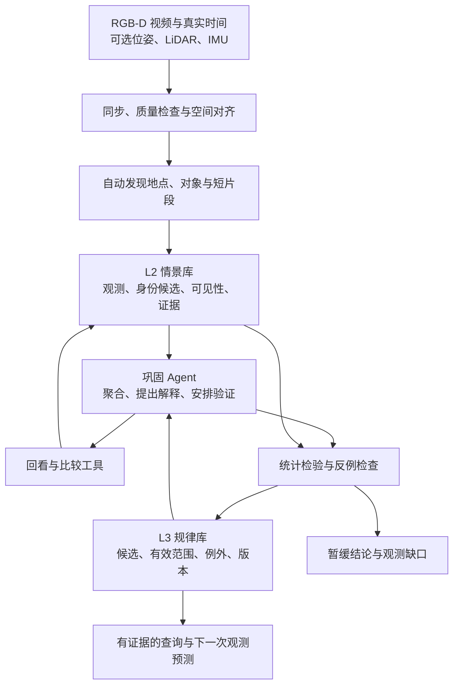

# 从重复巡检视频自主发现规律：L3 记忆巩固 Agent 方案

> 日期：2026-09-07；状态：探索中，待数据审计和实验验证。
>
> 本文是针对当前用户描述的研究与开发方案，不是已实现系统或实验结果。记忆系统先独立于机器人运行。技术组件均为候选，不冻结模型、平台或投稿目标。
>
> 配套文献与适用边界见 [证据表](l3-memory-consolidation-evidence-2026.md)。文中未明确标为文献事实的架构、参数、假设与进度均为本项目建议。

## 1. 问题定义与核心判断

现有输入是人在固定时间、沿固定路线手工操作机器人录制的重复巡检视频。没有明确检查点；多数设施和事件仅在路过时进入视野，少数地方停留较久。早期数据有 RGB-D，后期增加 LiDAR、IMU 或轨迹。采集时人为设置了一些对象状态和规律事件，但不应把设置答案提供给发现系统。

目标是让系统自动发现：

1. 哪些设施或空间区域反复出现，并建立跨巡检身份；
2. 这些设施在已观测条件下有哪些稳定状态或常见状态组合；
3. 哪些活动反复发生，其地点、时段、参与对象类别和过程有哪些共同结构；
4. 哪些候选规律得到跨日证据支持，哪些只是偶然、视角变化、采样偏差或证据不足；
5. 新数据进入后，如何保留例外、修订规律并回溯其依据。

**建议主线：先把路过观测组织成可回看的 L2 经历，再由能够检索、重看、提出假设和检验反例的 Agent，将其巩固为带适用范围与不确定性的 L3 规律。**

巩固的最小成果不是一段流畅的巡检总结，而是可执行的规律对象：给定地点、对象、时刻和观测条件，它能输出状态分布、证据、限制和版本。预测下一次观测用于检验 L3 是否学到规律，不将其直接宣称为完整 L4 规划能力。

当前不训练基础模型也可以开发这套系统。所谓“学习”首先发生在外部记忆的对象关联、状态原型、事件簇、统计参数与规律版本中；后续是否训练感知器或重看策略，由误差分析决定。

## 2. “极少预设”的可操作边界

零先验并不现实：预训练视觉与语言模型已包含类别和常识，聚类、时间建模也有归纳偏置。应把目标写成“无需场景专属资产清单、检查点和规律标签”，并记录实际使用了哪些先验。

| 可以提供的最小输入/机制 | 默认不提供给发现系统的内容 |
|---|---|
| RGB-D、真实时间戳、相机标定、深度单位和有效性定义 | 人工检查点及其名称 |
| 可选位姿、LiDAR、IMU，及来源和质量 | 预设资产 ID、目标对象列表、目标事件类别 |
| 通用观察目标：发现重复实体、状态及活动的时空模式 | “每天几点发生什么”的脚本和标签 |
| 通用数据结构、工具接口、算力预算、拒绝过度推断规则 | 人工正常状态、异常标准、区域功能答案 |
| 可扩展的类别/属性/关系注册表和周期模型族 | 强迫系统必须发现某个数目的规律 |

允许用“对象—属性—状态—事件—地点—时间”作为通用表达语法，具体对象类别、属性和值由观测中提出并版本化。例如可先记录 `entity_0042 / attribute_0007 / state_cluster_2`，随后用语言模型命名，不必最初就知道它是“柜门开合”。

**已读旧采集文档只用于理解实验背景。** 它们包含检查点和具体场景的设计建议，与这次实际无检查点的采集条件并不完全相同。当前设计以本次用户陈述为准，保留旧文档。正式运行应通过只读数据入口隔离设置表、说明答案的文件名、口述提示和评测标签；研究助手读过场景方案不等于未来的发现 Agent 可以读取它们。

## 3. 在开发前必须处理的可识别性

### 3.1 固定时间和路线的混淆

设环境状态为 `S`，有足够条件判断目标的观测机会为 `V=1`。仅用路过视频，直接可估计的通常是：

`P(S | 地点, 时段, V=1, 已覆盖的采集条件)`。

它不自动等于全天环境中的 `P(S | 地点, 时段)`。如果操作员看到活动才停留，观测机会还与事件本身相关。记录可见性可以避免把缺失当负例，但不能凭空消除这种选择偏差；没有覆盖的时段必须保留为未知。

例如每天 09:00 经过同一区域时看到清扫，以下解释可能都与现有观测相容：

- 只在 09:00 附近清扫；
- 整个上午都有人清扫；
- 人在机器人到达后按脚本开始清扫；
- 地点长期有这类活动，时间并无额外解释力。

如果数据没有区分这些解释的变化，Agent 应输出“在已采样的上午时段重复观测到清扫”，不能输出“每天 09:00 开始清扫”。不规则采样的周期分析也不会恢复完全缺失的信息；Lomb–Scargle 的采样窗与混叠问题见 [VanderPlas](https://arxiv.org/abs/1703.09824)。

### 3.2 四类记录必须分开

| 记录 | 示例 | 在统计中的用法 |
|---|---|---|
| 确认观测到 | 清晰看到设施指示灯亮 | 对该属性贡献一次正观测 |
| 确认相反/未出现 | 灯区域清楚可见但未亮；预期区域无遮挡且未见对象 | 在经过校准的检测条件下贡献负观测 |
| 看不清 | 遮挡、模糊、距离过远、身份不确定 | 未知；不能算负例 |
| 没有覆盖 | 相机未朝向该地点；该时段无视频 | 未观测；不能算负例 |

观测机会必须针对属性或事件定义：能认出柜子，不代表能看清柜门缝或小指示灯。事件负例也有范围：“这 6 秒内未看见清扫”不等于“上午未清扫”。

### 3.3 路过只能给出被截断的事件片段

`first_seen` 与 `last_seen` 首先表示相机观测边界，不是事件起止。如果进入视野时事件已经在进行，开始时间左删失；离开视野时仍在进行，结束时间右删失。跨巡检从关闭变为打开，只能定位到两个观测之间的变化区间。

不要用观察到的几秒推定真实活动时长，也不要把第一次看见的时刻当作周期事件开始时刻。第一版优先建模“路过时活动是否在进行”和“活动常见时段”；有完整边界的事件才估计起止和持续时间。

### 3.4 数据审计的结论应改变目标

| 实际数据情况 | 可以优先做的能力 |
|---|---|
| 无可信日期，仅有视频内相对时间 | 跨次实体、状态模式、局部过程；暂不声称日/周规律 |
| 多天，但每天仅在同一窄时段路过 | 该时段的重复出现与稳定状态；全天周期不可确认 |
| 多天、多个时段，并有有效正负观测 | 日内条件状态、活动时段及日周期候选 |
| 跨越多个星期且各星期相位有覆盖 | 才进一步比较周周期和工作日效应 |
| 对象从未清晰入镜，或事件从未被捕获 | 无法从当前数据恢复；应列出证据缺口 |

用户尚未确认实际天数、每天次数、时长、真实时刻和经过时间偏移。旧采集建议中的数量不能当作已录制事实。先完成不依赖这些数量的设计，时间模型的复杂度由审计结果确定。

## 4. 系统结构：快记录、慢巩固、按需回看



这里的快慢是职责分工。离线开发时可以全部在服务器上串行或批量执行；以后快通路可以随巡检运行，慢通路在一次巡检后或空闲时触发。参考 Khronos 的短期/长期分解、ReMEmbR/RAVEN 的可调用时空检索，以及 A-MEM 的记忆关联机制，但额外加入本任务所需的观测机会、统计规律和版本门控，不能认为这些已有系统已经完成本任务。[Khronos](https://arxiv.org/html/2402.13817v2)；[ReMEmbR](https://arxiv.org/abs/2409.13682)；[RAVEN](https://arxiv.org/html/2606.25206v1)；[A-MEM](https://arxiv.org/abs/2502.12110)。

## 5. 从无检查点视频构建 L2

### 5.1 数据入口与空间对齐

每次巡检为一个 `run`，保留设备原始时钟与校正后时间，不以文件创建时间替代。至少审计 RGB/深度配对、时间偏移、深度无效值、相机参数、模糊、曝光和各模态缺失区间。IMU 原始测量本身不等于可信轨迹。

空间处理有三条兼容路径：

1. **已有可信轨迹**：核对参考坐标系与跨次地图是否一致，必要时利用静态几何做多次轨迹配准；保留配准残差/质量标志。
2. **只有 RGB-D**：通过可替换的 RGB-D 里程计/SLAM 获得局部轨迹，用重访匹配和几何验证做跨次关联。RTAB-Map 提供 RGB-D 与多会话建图的实现入口，可作候选基线。[官方实现](https://github.com/introlab/rtabmap)。
3. **度量建图不可靠**：保留自动学习的拓扑地点、相似视图与相邻关系；用图像序列匹配提出重访候选，几何或多视角证据确认。无法确认的跨次身份保留候选，不强制拼成一个全局地图。

固定路线是可利用的弱约束，但不能按“视频第 5 分钟”直接对齐位置。走路速度和停留不同；序列匹配/动态时间规整只能提出候选，在重复走廊、逆向经过和路线交叉处仍需空间验证。

后期 LiDAR/IMU 主要用于改善定位、相机运动补偿、几何及遮挡判断；小灯颜色、细微开合和活动语义仍依赖视觉。后期传感器质量变化可能伪装成环境变化，必须记录 `sensor_profile_id`。

离线整理全量历史时可研究用后期几何帮助早期配准，但这是“回顾性重建”协议。做按时间预测的主实验时，地图、关联与记忆只能使用当时及之前可用数据；不能把测试日地图或新传感器的信息提前交给系统。

### 5.2 自动地点与“相遇片段”

自动地点是机器人反复获得相近场景证据的空间单元，不是人工检查点。可基于关键帧位姿邻近、视图重叠、视觉描述子、局部几何与连续性形成拓扑节点，并允许增量拆分/合并。

比地点更关键的基本单元是 `encounter`：某个对象或局部区域连续可观测的一段时间。出现、离开视野、长遮挡、视角显著改变都可以切分；停留只是提高质量的线索，不是成立条件。

通路采用三种互补采样：

- 全路线低成本覆盖：按时间/位移/视角变化选帧，保证没有变化的设施也会被发现；
- 新奇与变化触发：场景新颖、运动补偿后局部变化、对象出现、关系改变时保留更密片段；
- 候选规律驱动重看：巩固时返回原视频，补看原先没有命名或没有注意的细节。

试运行可从 0.5–1 Hz 的粗索引、2–8 秒的重叠短片段开始调参，属于算力起点而非事件最短时长假设。快速事件需要原始帧率或更密窗口；原视频保留，所以粗索引遗漏有可能被后续重看找回。首次发现召回率仍需抽样复核，不能假定后续一定能补救。

### 5.3 开放发现对象与属性

采用“与类别无关的候选区域 + 自动语义命名”组合：从分割、深度几何或运动中产生区域/轨迹，再由 VLM 描述；也可用 VLM 对全景提出类别词，再用开放词汇检测器定位。保留未命名对象及未分类活动簇。

SAM 2 可用于候选掩码跨帧传播，Grounding DINO 可用文字提示定位对象，DINOv2 类特征可用于视觉相似性候选；这些工具各自不保证发现所有实体，也不独立提供跨日身份或事件语义。[SAM 2](https://arxiv.org/abs/2408.00714)；[Grounding DINO](https://arxiv.org/abs/2303.05499)；[DINOv2](https://arxiv.org/abs/2304.07193)。

属性发现分两条：

- **语义属性**：VLM 从实际可见区域提出颜色、开合、摆放、显示内容等属性候选，随后在同类观测上验证该属性能否稳定判读；
- **未命名状态**：将同一实体经视角对齐的局部特征聚类，先形成 `state_A/B`，再比较代表片段解释区别。若聚类主要由光照、遮挡或镜头方向决定，应记录为观测条件，不能当对象状态。

每项属性可以选择适合的判读工具：几何/位姿、局部分类、OCR、区域对比或视频 VLM。选择可以由 Agent 触发，但工具必须返回原图位置和可判读性。小指示灯、显示屏和细小结构可能需要专用工具或补采，基础模型无可靠判读时返回未知。

### 5.4 跨次实例身份

持久 `entity_id` 由多证据关联得到：空间邻近及不确定性、局部几何、外观特征、周围稳定对象、短期轨迹连续性。类别文本只作辅助，不按“都是红色柜子”合并实例，也不把固定像素位置当世界位置。

必须区分：

- 固定位置的一处设施/安装位；
- 可能搬动的物体实例；
- 每次出现的匿名人员或车辆；
- “有人在这里清扫”这类活动角色和类别。

对于外观相同且互换后无法辨识的设施，可退化成“该安装位上的某类设施”，不伪称跟踪了物理上同一实例。动态事件通常不需要跨日认出同一个人。

模糊关联保留多个候选及分数；语言描述改变不更换 ID。合并/拆分建立 lineage，依赖该身份的状态统计和规律必须能被标记失效并重新计算。

### 5.5 从活动片段形成事件类别

对重叠短片段提取参与对象类别、动作、相对运动、空间关系、前后状态及视频嵌入，再按局部时序模式聚类。相机自身运动要先补偿；“机器人经过一辆停着的车”不能被解释成“车驶入”。

同一天相邻片段先去重、拼接；跨日相似片段形成事件类型候选。活动名称来自簇内代表片段的共同可见特征，并保留名称版本。聚类可先不使用绝对时刻，再在独立步骤检验时间规律，减少“因为都在早上所以被分成一种事件”的循环论证。

片段只包含中间动作时，记录部分事件。完整的“到达—作业—离开”图式需要多次完整或互补且可验证的序列；不能让 VLM 用常识补齐未拍到的环节。关系时序表示有机器人无监督活动学习的先例，但迁移到本数据需要重新验证。[Duckworth et al., 2019](https://doi.org/10.1016/j.artint.2018.12.005)。

## 6. 记忆对象与存储契约

用关系表/文档保存事实与外键，用视觉/文本向量索引寻找候选，用原始媒体保存证据。第一版无需同时部署复杂图数据库和多个分布式服务；图关系可通过表表达，存储后端保持可替换。

| 对象 | 核心字段 |
|---|---|
| `Run` | ID、起止时间、时区、时钟来源、传感器配置、标定、数据校验值、质量区间 |
| `Place` | 自动地点 ID、拓扑相邻、可选几何范围、代表视图、地图版本 |
| `Entity` | 自动实体 ID、类别分布、几何/外观原型、身份候选、安装位关系、版本沿革 |
| `Encounter` | run、place、entity 候选、观察开始/结束、视角、连续性、证据引用 |
| `Observation` | 属性和值/分布、判读条件、未知原因、局部区域、时间、模型/提示版本 |
| `Opportunity` | 可判断的目标/属性/事件、可见区间、覆盖范围、质量、检测校准版本 |
| `Event` | 类型候选、参与角色、地点、观测区间、起止删失、动作/关系序列、证据 |
| `Hypothesis` | 候选规律、备选解释、发现数据范围、验证计划、反例查询、当前状态 |
| `Rule` | 适用条件、状态/事件分布、独立样本量、支持/反例/未知、验证指标、有效期、版本 |
| `EvidenceRef` | 媒体标识、run、时间或帧号、ROI/mask、标定/位姿版本、派生任务 ID |

原始观测和派生解释分层追加。记录 `observed_at`（何时看见）、`inferred_at`（何时推断）及 `valid_time`（结论适用时间），才能回答“当时系统知道什么”和“现在回看认为发生了什么”。

置信度分开表达：感知质量、身份关联、覆盖充分性、统计区间、留出预测表现。未经校准的 VLM 自评分不能充当规律成立概率，也不把高度相关的多个模型分数直接相乘。

## 7. L3 规律建模与巩固判据

### 7.1 稳定设施与日常状态

按“实体/安装位—属性—可比较条件”汇总独立 encounter。一次停留 300 帧主要提高这次判读质量，不等于 300 次跨日支持。对长期常态，按 run 聚合、按日期统计相关性；对日内差异保留各时段，但推断时以日期成组处理。

二元状态可用 Beta–Bernoulli 作最小基线，多状态用 Dirichlet–Categorical，连续量用稳健分位数或适当的概率模型。最简单二元形式为：

`p ~ Beta(a,b)`；在 n 次近似独立、可判读观测中有 k 次状态成立，则 `p | data ~ Beta(a+k,b+n-k)`。

它只在相应独立性、观测误差和覆盖条件下成立。第一版只纳入高质量离散判读并报告丢弃比例；存在强日期相关性时，用按日期 bootstrap 或分层模型替代天真区间。感知置信度作为小数计数只是一种近似，不能冒充严格校准的后验。

保留多模态常态，如某设施在上午常关闭、下午常打开；不要用全局众数掩盖它。稳定性、支持日期数、可观测覆盖、留出预测与复杂度共同决定是否巩固，不能仅凭出现次数。

**常见不等于符合规范。** 系统从视频学到的是“常见状态”或“统计偏离”；设备是否安全正常需要另行提供制度/技术标准。即使某个不合规状态持续出现，也不能由统计常见性推断为安全。

### 7.2 时间与周期规律

先把事件类型发现和时间分布估计分开，按由简到繁比较：

| 候选 | 用途 | 启用条件 |
|---|---|---|
| M0：仅地点/实体的常数分布 | 无时间规律的强基线 | 始终保留 |
| M1：宽时段条件分布 | 上午/下午等差异 | 多时段存在有效观测，分箱规则在开发集冻结 |
| M2：少量周期项的模型 | 平滑的日内或其他周期候选 | 时间跨度与相位覆盖允许，较 M0/M1 有留出增益 |
| M3：星期/上下文条件 | 工作日、角色、共现对象等 | 多个独立周期，且每个条件有足够数据 |
| M4：分段/漂移模型 | 新旧时段或常态的切换 | 反复新证据不能由观测质量或身份问题解释 |

可以用 FreMEn 作为机器人时间规律的经典基线；它以频率表示动态环境状态。若自行构建二元事件模型，可采用带少量正弦/余弦项的 logistic 回归，使输出始终是合法概率。周期项及周期范围由开发协议约束并在验证集选择；把日历周期作为候选是显式先验，不应描述成完全无先验发现。[FreMEn](https://iliad-project.eu/publications/2017-2/fremen-frequency-map-enhancement-for-long-term-mobile-robot-autonomy-in-changing-environments/)。

Lomb–Scargle 可辅助给连续状态序列提出周期候选；二元事件、稀疏窗口与不完整边界需要相应观测模型，不能把“无视频”补零后直接做频谱分析。出现时刻的聚集也可能只是采样时刻聚集，应同时检查 opportunity 的时间分布。

对活动的“路过时在进行”使用 encounter 级状态概率；只有观察到发生起点并有覆盖区间时，才另行估计发生次数/暴露时间的事件率。不要混用活动占用比例和开始事件频率。

不同解释若在已采样时刻给出近似相同预测，则保留不可区分状态。跨日验证也可能反复复制相同采样偏差，因此必须把适用范围限定在已有覆盖，而不是借留出成功声称全天周期。

### 7.3 事件过程图式

第二阶段以后再加入“在某处经常发生 A→B→C”的部分序列规律。统计支持要按独立事件实例计算，保留缺失步骤、观测断点和可替代分支。先预测下一项可观测关系，再考虑更复杂的时序图式或半马尔可夫模型。

固定路线造成的“先看见门，再看见垃圾桶”属于机器人观察顺序，不能当作环境事件的因果流程。对象共现可以支持区域功能假设，但具体功能名称仍须证据支持，不能仅靠常识命名就算完成 L3 学习。

### 7.4 巩固、例外与修订

规律生命周期：`candidate → provisional → consolidated → disputed → superseded/retired`。状态提升/降级须有机器可检查的理由。

写入检查包括：证据可定位、去重后的独立样本数、观测机会分母、身份稳定性、与无规律基线的比较、反例覆盖、时间外验证和适用范围。具体阈值在小规模先导数据上确定并冻结；“三次即规律”只能是候选触发启发式，不能是可靠性结论。

同时发现大量属性/周期容易产生假规律。限制候选复杂度和数量，在开发数据上生成、在独立验证日期上筛选；若使用显著性检验，应按预先定义的检验族处理多重比较。供 Agent 反复查看调参的数据就是开发数据，不能继续称为隐藏测试。

新反例先检查观测质量、身份、适用条件，再区分一次例外与持续漂移。可比较稳定模型和变化点模型；BOCPD 是候选统计工具，其假设和先验需记录。[Adams & MacKay](https://arxiv.org/abs/0710.3742)。

持续变化可形成新统计常态，但旧规则保留有效期、替代关系和反例；任何规范规则独立保存。第一版巩固只压缩活跃索引、建立代表样本集，不删除支撑规律、反例和不确定片段的原始证据。

巩固后的活跃记忆保留：对象/状态/事件原型、去重后的统计量、代表正例、最有区分力的反例、边界案例和完整证据索引。多个 run 中重复的描述可以折叠为一个规律及其支持清单；这是外部记忆的抽象和压缩，不是把经历改写成基础模型权重。重放选取代表样本与反例混合，避免只复习支持结论的片段；重放同一个样本也不增加独立样本数。身份或判读版本改变时，从原始记录重算依赖统计，而不是只修改总结文字。

## 8. Agent 的实际职责与执行边界

### 8.1 一个协调 Agent 足以启动

初版采用一个协调 Agent 加确定性工具和持久任务状态。发现、重看、验证可以是不同角色/提示，但没有必要先开发复杂多 Agent 社会。身份合并、统计计数和规则晋级由可重放程序执行；VLM/LLM 负责提出语义解释和安排下一项有价值的检查。

它接收长期任务：“从已提供经历中寻找可重复的状态与活动模式，报告依据、例外和覆盖边界；没有规律时允许不产出规律。”无需等待用户先问某个具体对象。

### 8.2 最小工具集合

| 工具（建议接口） | 用途与返回值 |
|---|---|
| `scan_unprocessed(run_id, budget)` | 全路线补齐低成本覆盖，返回新片段与覆盖缺口 |
| `list_entities / list_event_clusters` | 列出自动发现对象、活动簇、质量与尚未分析的项 |
| `retrieve_encounters(filters, sample_policy)` | 按实体/地点/时段取经历，支持跨日分层抽样 |
| `inspect_clip(evidence_ref, roi, temporal_density)` | 返回原始短视频/多视角、属性判读和可判读性 |
| `compare_encounters(ids, attribute)` | 并排比较相同实体的证据，输出相同/不同/未知 |
| `query_opportunities(target, interval)` | 返回正例、负例、未知与未覆盖窗口，而非只有检索命中 |
| `fit_pattern(data_snapshot, family, options)` | 运行注册模型，返回参数、样本单位、区间与基线 |
| `validate_hypothesis(id, validation_snapshot)` | 固定候选后计算验证表现与覆盖限制 |
| `search_counterexamples(hypothesis, scope)` | 搜索反例、不同条件和最容易混淆的实例 |
| `propose_rule / commit_rule / revise_rule` | 候选编辑与确定性门控写入，追加版本和证据 |
| `request_observation_gap(target, time_range, reason)` | 输出当前数据无法解答的问题；离线只生成建议 |

相似性检索不能提供全体分母。统计之前必须通过结构化查询列出所有适用机会，并对正负和未知分别计数。工具返回结构化结果和证据指针，LLM 不自行口算支持次数。

### 8.3 一次巩固循环

1. 根据新 run、身份变化、状态冲突或新活动簇生成待办。
2. 选择有跨次证据的目标，同时为新对象和罕见活动保留探索预算。
3. 读取跨日摘要和少量代表原始片段，形成一个可计算假设及至少一个备选解释。
4. 明确验证会使用哪些日期、哪些属性和什么负例；调用工具检查机会分母。
5. 对关键疑点重看，例如灯是否真的关闭、是否错认成邻近设施、事件是否只是机器人运动。
6. 在开发数据上拟合简单模型，并与无时间/无条件模型比较。
7. 固定候选，在验证数据上查反例和计算指标；决定暂缓、修订或巩固。
8. 提交版本、证据和结论范围；记录新问题，预算耗尽时可恢复执行。

Agent 的增益应来自“把额外计算用于改变结论的证据”，而非凭反思提高自信。每次重看记录目标、证据 ID、新增信息与成本；同一证据的重复描述不增加统计支持。

### 8.4 调度、预算和失败处理

按每小时视频、每个候选、每次巩固分别设置解码帧数、VLM 调用、检索条数、最大重试和时间预算。缓存键至少包括媒体哈希、ROI、模型/提示版本；写入采用幂等任务 ID，模型超时后允许继续其他目标。

重看优先级可先用“候选价值 × 不确定性 × 预期新信息 / 计算成本”的可解释启发式，同时保留固定比例的覆盖检查；其权重是待验证配置。之后再比较学习调度策略。当前只有离线数据时，Agent 可以重新解码、裁剪、换工具、换证据，不能真的获得相机没有拍到的视角。

### 8.5 规律输出示例（完全虚构，仅说明格式）

```yaml
rule_id: rule_demo_001
status: provisional
target: place_012 / event_cluster_003
statement: 在已覆盖的上午巡检时段，该区域反复出现清扫活动
scope:
  observed_time_of_day: 08:50–09:10
  timezone: Asia/Shanghai
  outside_coverage: unknown
  event_start_time: unknown
counts:
  visits: 10
  judgeable_visits: 8
  activity_present: 7
  activity_absent_during_visible_clip: 1
  unknown_visits: 2
  distinct_dates_with_judgeable_visits: 8
model:
  family: beta_bernoulli
  prior: [1, 1]
  posterior: [8, 2]
  interpretation: 有效路过观测下活动正在进行的概率，非全天发生率
evidence:
  support_ids: [demo_support_list_ref]
  counterexample_ids: [demo_counterexample_ref]
  unknown_ids: [demo_unknown_list_ref]
alternative: 活动可能覆盖整个上午，当前观察窗口无法区分
validation: 尚无独立后续日期验证，暂不晋级
```

真实存储中列表引用必须展开为可校验的 ID 清单，工具核对数量。不能把 7/8 简单呈现为“规律有 87.5% 概率是真的”；它首先只是样本比例，后验区间也受独立性和感知误差假设约束。

## 9. 与机器人解耦的实现路线

### 9.1 输入输出与模块

离线记忆服务接收标准 `RunManifest` 和媒体/位姿引用，对外提供：

- `ingest(run)`：导入并生成处理任务；
- `consolidate(scope, budget)`：发现/更新候选规律；
- `query(question, as_of)`：给出有时间版本和证据的回答；
- `predict(target, time, context, as_of)`：给出下一次可观测状态的分布及适用范围；
- `explain(rule_id)`：展示支持、反例、未知和修订沿革。

共享代码将来放在 `src/` 下，建议逻辑边界为 `ingest / perception / association / episodic / patterns / agent / evaluation`；此次只提供设计，不创建空代码框架。

初版可用本地文件存原始证据、嵌入索引做召回、单个关系数据库存结构化记录、可恢复任务队列跑后台任务。只在实际规模要求时替换为网络服务。

现有 HoloAgent 可在后续通过薄适配层调用查询、预测和观测缺口工具。其技能运行文档见 [AgentOS README](../../src/HoloAgent/agentic_robot/agentOS/README.md)。本方案不依赖它，也不改动其机器人控制模块。

### 9.2 模型选择的实测准则

先选两种可替换感知配置跑同一小样本：一种高能力参考配置、一种低成本配置。比较对象发现召回、属性可判读正确率、短事件识别、未知校准及成本。此时不凭通用榜单锁定某个 VLM。

身份描述子、状态描述子和语义检索嵌入可以不同：强语义相似不等于同一实例，也不等于状态差异敏感。保留原始图像和 ROI，使换模型后可以重新计算，不被早期 caption 永久限制。

不用先微调通用 VLM、训练世界模型或强化学习整个 Agent。若主要错误是灯太小、视角过差或时间无覆盖，扩大模型或上下文不能替代数据质量；若主要错误是少数稳定属性判读，再考虑小规模标注与专用模型，且与“无需场景规律监督”的主设置分开报告。

### 9.3 计算量先度量再承诺

粗索引帧数约为 `视频秒数 × 索引频率`；昂贵视频调用数取决于 encounter、候选和重看比例。记录每视频小时的总处理时长、VLM 输入量、调用数、峰值显存、索引和证据存储量。没有实际视频量与硬件数据前，不承诺吞吐、费用或单卡可运行。

## 10. 评测：证明规律来自记忆且 Agent 有增益

### 10.1 两层真值与三种实验条件

将现场设置表作为“预期世界规律”，将独立人工视频复核作为“当前传感器确实可观察到什么”。脚本设置了事件但未被拍到，不应要求系统无证据地正确总结。

主报告同时呈现：全部脚本目标的端到端发现率、其中可观测目标比例、可观测子集的算法质量。不能只挑看得清的结果宣称整体成功。

建议三种条件：

1. **完整自主条件**：无人工对象/事件/检查点标签，仅传感器与允许的元数据；是主结论依据。
2. **身份/位姿辅助条件**：提供人工关联或优质位姿，只诊断空间关联瓶颈，不能替代主结果。
3. **结构化观测辅助条件**：使用人工状态/事件记录检查规律模型的上限，只诊断巩固机制。

### 10.2 时间划分与防泄漏

按完整日期/事件实例划分开发、验证、隐藏测试，避免相邻帧和同一布置过程跨集合。天数充足时可考虑约 60/20/20；天数很少则采用明确的滚动时间起点评估，并承认高方差，不能为了凑比例损失周期覆盖。

严格顺序：预测第 d 天 → 用独立标签评分 → 再将第 d 天观测写入记忆。隐藏测试不向发现 Agent、反例检索或提示调优开放。地图和对象词表也遵守 `as_of` 限制；全量回顾性重建另列结果。

### 10.3 必须有的基线

| 基线 | 所回答的问题 |
|---|---|
| 单次视频/有限上下文 VLM 总结 | 多次记忆是否必要 |
| 等预算跨日视频或 caption 的批量 VLM 总结 | 结构化巩固是否比直接总结更可靠 |
| ReMEmbR 式 caption + 时空检索 | 仅扩大可检索历史是否足够 |
| RAVEN 式视觉证据检索 | 收益是否来自保留图像而非巩固机制 |
| 相同自动 L2 + 固定统计流程 | Agent 自适应重看与假设检验是否有额外收益 |
| 相同 L2 + 恒定众数/时段模型/FreMEn | 复杂时间模型是否确实胜过简单统计 |
| 完整系统与去除 opportunity/身份不确定性/反例/版本门控 | 各机制是否解决了相应错误 |

Agent 与固定流程要共享感知结果、模型能力和检索/重看总预算；另加同预算随机重看或固定跨日分层重看。否则“用了更多帧和更强模型”就足以解释提升。

### 10.4 指标与验收逻辑

| 层次 | 主要指标 |
|---|---|
| 感知与对齐 | 对象发现召回、跨次身份 precision/recall、可判读状态准确率、事件片段匹配、unknown 的误判率 |
| 规律发现 | 匹配预定义语义槽位后的 precision/recall、支持不足的过度概括率、规律冗余率、到原证据可追溯率 |
| 泛化 | 隐藏后续日期的 log loss/Brier、相对 M0 的增益、适用范围内校准、不同观察时长下表现 |
| 时间规律 | 在确有真值/覆盖时报告周期与相位误差；起止未拍全时只评观测时段，不计算伪精确开始误差 |
| 稳定性 | 单次反例下的错误覆盖、真实漂移后的更新时间、错误关联修正后的规则重算正确性 |
| Agent 价值 | 等预算下规律 precision–recall、每个正确规律的重看成本、每视频小时误规律数、调用成功率 |
| 资源 | 每小时视频耗时/输入量、峰值资源、每条规律存储量、随巡检次数增长的成本 |

语义匹配采用“目标/区域、属性或事件、条件、时间范围、量词、例外”槽位，结合独立人工复核；文本相似分数或同一个 LLM 裁判不能作为唯一正确性依据。按日期/独立事件给出不确定性，种子重复不等于增加真实环境样本数。

在首个先导实验后冻结通过线。当前可先冻结逻辑门槛：每条输出必须有证据；未知不得作为负例；时间模型必须与无时间基线比较；超出观测覆盖的结论必须降级；不因无足够规律而强制凑输出数量。

### 10.5 关键压力测试

对现有数据能真实支持的扰动进行控制实验：重复帧/延长停留、删除某次经过、裁剪视野、降低清晰度、位姿扰动、相似对象、单次例外、持续状态改变、传感器配置切换。原始数据保持只读，所有扰动版本记录来源和参数。

“按时间打乱”只能作为有条件的诊断：置换必须保持合理的分组和覆盖约束，不能随意打乱帧。若固定路线时间与地点完全共线，没有合法反事实可供区分，就直接报告不可识别，而不是靠一个无效置换检验证明时间规律。

最有价值的额外采集是少量不同时间经过、改变经过速度或方向、在活动前后观察，以及对非预期时段提供负证据。补采由不确定性选择，不要求给 Agent 增加人工检查点标签；纯离线版本只输出补采建议。

## 11. 分阶段开发计划与停止条件

以下为范围估计，不是进度承诺。时间受数据导出、可用位姿、硬件和事件难度影响。

| 阶段 | 交付与大致工作量 | 进入下一阶段的条件 |
|---|---|---|
| P0 数据与可识别性审计 | 约 2–4 个工作日；run 清单、传感器质量、经过时间分布、可观测目标复核 | 能明确哪些规律可学，哪些暂不可识别 |
| P1 无检查点 L2 | 约 1–2 周；自动 encounter/地点/实体、状态/事件候选、证据浏览 | 跨次身份与可判读性达到任务可用水平，失败可定位 |
| P2 固定巩固基线 | 约 1 周；常态/时段/周期候选、验证与规律卡 | 相对直接总结得到可复现结果；可以发现也可以拒绝候选 |
| P3 巩固 Agent | 约 1–2 周；工具调用、预算重看、反例查询、门控写入 | 等预算与固定/随机重看相比有质量或成本增益 |
| P4 长期回放与修订 | 约 1–2 周；滚动预测、漂移、关联纠错、消融 | 结论可追溯，误规律与漂移适应的权衡明确 |
| P5 可选机器人适配 | 待离线结果后估计 | 不改记忆核心即可接收实时经历和返回查询 |

最小端到端切片：选覆盖较好的若干完整 run 作为开发子集，但不在输入中标出目标设施；系统发现全部候选，由独立评测者检查其中固定设施状态和重复活动。先做出“发现对象 → 跨日聚合 → 暂定规律 → 找到反例/未知 → 下一次预测”的完整可解释实例，再扩大全数据。

若 P1 身份关联很差，先用辅助条件判断是否是定位瓶颈；若结构化真值下时间规律仍不可识别，应降低目标或补采，不继续堆叠 Agent；若 P3 在等预算下不优于固定流程，保留固定流程并如实报告，不能为了 Agent 形式牺牲结果。

## 12. 可检验研究假设与贡献边界

| 假设 | 最小对照 | 可能否定它的结果 |
|---|---|---|
| H1：显式观测机会减少虚假缺席和伪周期 | 相同 L2，有/无 opportunity | 控制质量和覆盖后，无实际改进或召回损失过大 |
| H2：身份与证据约束的巩固优于直接总结 | 同模型、同预算的跨日总结 | 独立日期预测与误规律率没有改善 |
| H3：有目标的 Agent 重看比固定/随机重看更高效 | 相同 L2、相同总重看预算 | 质量–成本曲线没有优势 |
| H4：候选与版本机制兼顾例外和漂移 | 立即覆盖、永不更新、门控修订 | 门控仅延迟所有更新，不能降低错误固化 |

这些是本项目尚未验证的假设，实验立项时按仓库规范拆成独立假设文件。暂不宣称机制或组合具有新颖性；正式研究定位还需针对 observation-aware temporal induction、长期变化检测和 agentic memory 做更完整的相近工作核查。

比“机器人能回答巡检视频问题”更贴合当前任务的研究表述是：**在没有场景专属检查点和规律标签、且观测稀疏并受巡检策略影响时，系统如何从重复经历中形成可检验、可修订的时空规律，并知道哪些结论当前无法确定。**

## 13. 当前交付与尚未执行的工作

本次完成：读取项目约定及相关采集/研究文档；检索并比较原始论文与官方实现资料；给出端到端设计、表示、模型候选、Agent 工具、评测和实施阶段。

未执行：原始巡检视频/传感器审计、模型推理、SLAM、实体关联、规律发现、速度测试及真机实验。当前 `data/` 未提供真实数据清单，用户也尚未给出数据位置。本文所有例子和参数起点均不是实测结果。

第一项落地工作是生成现有数据的 run/时间/模态/覆盖清单，据此决定以稳定设施、窄时段重复活动还是完整日周期作为首个验证目标。
